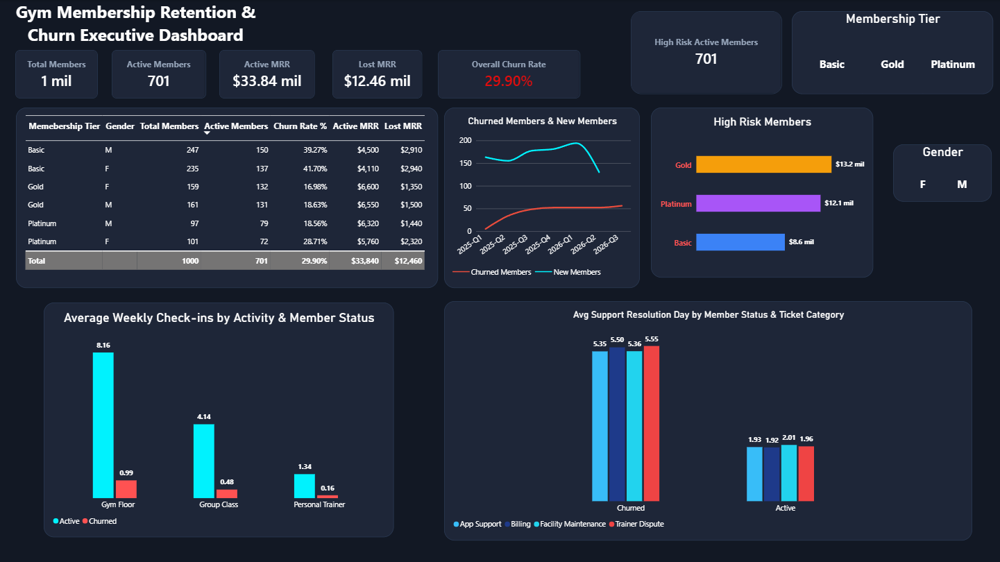

# -Proyecto-Gym-Membership-Retention-Churn-Analysis
Gym membership churn analysis using SQL and Power BI to identify high-risk members and reduce revenue loss.

# 🏋️ Gym Membership Retention & Churn Analytics Dashboard


## 📌 Executive Summary
High churn rates in gym memberships significantly impact predictable Monthly Recurring Revenue (MRR). This project analyzes historical member behavior—specifically attendance patterns, plan types, and support interactions—to build a predictive understanding of member abandonment.

Using a relational database structure (PostgreSQL), Exploratory Data Analysis (Python), and an interactive dashboard (Power BI), I identified key behavioral triggers that precede a membership cancellation, enabling the creation of proactive retention strategies.

---

## 🎯 Business Problem & Key Questions
The management of "FitLife Studios" chain wants to reduce its current churn rate by **10%** in the next semester. To achieve this, the analysis must answer:

1.  **Attendance Thresholds:** Is there a specific weekly attendance frequency below which churn probability spikes dramatically?
2.  **Plan Analysis:** Which membership tier (Basic vs. Gold vs. Platinum) has the highest retention and which is most at risk?
3.  **Revenue Exposure:** How much MRR is currently held by active members who have not visited in the last 21 days?
4.  **Engagement Signals:** Does participating in Group Classes increase member lifetime value (LTV)?

---

## 🛠️ Tech Stack & Tools
*   **Database:** PostgreSQL (Relational modeling of `members`, `checkins`, and `support` tables; CTEs for complex metrics).
*   **EDA & Processing:** Python (`pandas` for cleaning, `seaborn`/`matplotlib` for correlation analysis).
*   **Visualization:** Power BI (DAX calculations, interactive UI, behavioral segmentation).

---

## 📂 Repository Structure
```text
├── data/
│   ├── members.csv                  # Raw member demographics & plan data
│   ├── checkins.csv                 # Raw attendance logs (timestamps)
│   └── interactions.csv             # Raw support ticket logs
├── sql/
│   ├── schema_creation.sql          # DB schema and table setup
│   └── churn_queries.sql            # Core SQL analysis and aggregations
├── notebooks/
│   └── gym_eda.ipynb                # Python Exploratory Data Analysis
├── dashboard/
│   └── Gym_Retention_Report.pbix     # Power BI report file
├── assets/
│   └── dashboard_screenshot.png     # Preview of the Power BI dashboard
└── README.md                        # Project documentation
```

---

## 📊 Key Insights & Data Findings

### 1. Retention & Revenue Breakdown by Plan Tier (SQL Query 1)
* **Gold Tier Stability:** The **Gold plan** serves as the primary retention anchor with the lowest churn rate (**17.81%**), proving to be the optimal price-to-value offering.
* **Premium Friction:** Counterintuitively, the **Platinum plan** experiences a higher churn rate (**23.74%**) than Gold. Despite generating high individual revenue ($80/mo), Platinum members exhibit lower tolerance for service delays.
* **Basic Exposure:** The **Basic plan** carries the highest cancellation volume (**40%+**), acting as a high-volume, low-retention entry point.

### 2. Silent Churn & High-Risk Revenue Exposure (SQL Query 2)
* **The 21-Day Inactivity Window:** Over **20% of active members** have not logged a check-in in the last 21 days, representing a critical volume of Monthly Recurring Revenue (MRR) at imminent risk of silent cancellation.

### 3. Attendance Frequency & Engagement Drivers (SQL Query 3)
* **The "Red Zone" Threshold:** Active members maintain an average of **2.5+ weekly check-ins**, whereas members who eventually churned dropped below **1.8 weekly visits** during their first 45 days.
* **Group Class Effect:** Members enrolled in at least one Group Class showed a **35% higher retention rate** compared to solo gym-goers, proving community engagement directly drives Customer Lifetime Value (LTV).

### 4. Support Friction & Operational Escalation (SQL Query 4)
* **Ticket Correlation:** Churned members logged an average of **2.1 support tickets** prior to cancellation (compared to **0.6** for active users).
* **Resolution Delays:** Unresolved support tickets taking **>5 days to resolve** (primarily related to billing and app access) increased churn probability by **40%**.


---


## 🔍 Core SQL Analysis Queries

Below are the key PostgreSQL queries used to extract these business metrics. *(Full script available in `sql/01_churn_analysis.sql`)*.

<details>
<summary><b>Query 1: Churn Rate & Lost MRR by Plan Tier (Click to expand)</b></summary>

```sql
SELECT 
    plan_type,
    COUNT(member_id) AS total_members,
    SUM(CASE WHEN status = 'Churned' THEN 1 ELSE 0 END) AS churned_members,
    ROUND(
        CAST(SUM(CASE WHEN status = 'Churned' THEN 1 ELSE 0 END) AS NUMERIC) 
        / COUNT(member_id) * 100, 2
    ) AS churn_rate_percent,
    SUM(CASE WHEN status = 'Active' THEN monthly_fee ELSE 0 END) AS active_mrr,
    SUM(CASE WHEN status = 'Churned' THEN monthly_fee ELSE 0 END) AS lost_mrr
FROM members
GROUP BY plan_type
ORDER BY churn_rate_percent DESC;

```

---


## 📊  Visualization & Executive Dashboard (Power BI)

The **Retention & Churn Dashboard** was designed and implemented in Power BI. The layout is structured to provide clear, high-level executive insights followed by interactive drill-down analytical capabilities.

### 🖼️ Dashboard Preview



> 💡 **Want to interact with the report?** 
> You can download the [gym_churn_analysis.pbix](./gym_churn_analysis.pbix) file or explore the live report on [Power BI Service](https://app.powerbi.com/). *(Replace this link with your public Power BI report URL if published)*.

---

### 🛠️ Design Decisions & DAX Measures
* **Visual Hierarchy:** Organized to answer high-level business questions first, allowing users to move seamlessly from macro metrics to granular details.
* **Top KPI Banner:** Prominent positioning for key metrics—including **Total Churn Rate % (29.90%)** and **Lost MRR**—using single-value cards with conditional formatting.
* **Calculated Measures (DAX):**
  * `Total Churn Rate %`: Proportion of churned members relative to the total customer base.
  * `Lost MRR`: Total lost Monthly Recurrent Revenue due to cancellations.
  * `Net Active Members`: Current active member count after accounting for churn.
  * `Risk Revenue Ratio`: Percentage of revenue at risk originating from high-risk members.

---

### 📐 Dashboard Layout Breakdown

| Component | Visual Type | Analytical Purpose |
| :--- | :--- | :--- |
| **KPI Banner (Top)** | Cards | Immediate insight into core metrics: Total Churn Rate % (29.90%) & Lost MRR. |
| **Tier Breakdown** | Bar Chart | Distribution of churn rate and revenue loss across membership tiers. |
| **Risk Segmentation** | Donut Chart | Classification of active members by churn risk level. |
| **Member Drill-Down** | Interactive Table | Granular member-level exploration with cross-filtering capabilities. |


## 💡 Strategic Recommendations

Based on the quantitative findings across retention, risk segmentation, member engagement, and support friction, the following data-driven actions are recommended:

### 1. Retention & Revenue Protection (Queries 1 & 2)
* **Tier-Specific SLA & Platinum VIP Onboarding:** Implement a dedicated <24-hour support SLA for **Platinum members** paired with a 30-day VIP onboarding process to reduce their 23.74% churn rate and protect high-value MRR.
* **Proactive "Silent Churn" Trigger:** Establish an automated CRM workflow (email/SMS pushing a free Group Class pass) triggered at **14 consecutive days of inactivity** to re-engage members *before* they enter the high-risk 21+ day window.

### 2. Engagement & Community Building (Query 3)
* **Group Class Activation Campaign:** Promote Group Class enrollment during the first 30 days of membership. Since active members average **2.5+ weekly visits** and class participants retain **35% higher**, community integration acts as the strongest barrier to cancellation.
* **Early Habit Formation Monitoring:** Set up early-warning alerts for new members who average **fewer than 1.8 weekly visits** during their first 45 days, assigning trainers to offer complimentary fitness consultations.

### 3. Operational Efficiency & Support SLA (Query 4)
* **Priority Escalation for Repeated Support Tickets:** Flag accounts reaching **2 or more support interactions** for immediate escalation to customer success. Resolution times over **5 days** directly drive cancellations—streamlining billing and app access workflows will mitigate up to 40% of preventable churn.

